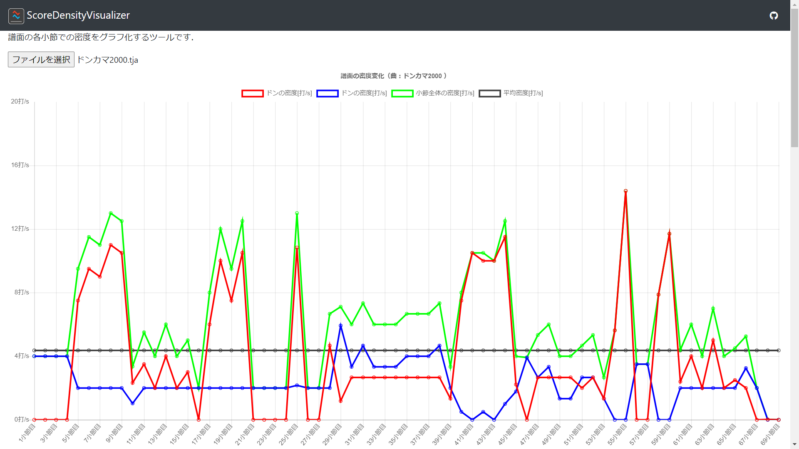

# ScoreDensityVisualizer
- 譜面中の各小節での密度をグラフ化するツール
- [GitHub Pages](https://mos305.github.io/ScoreDensityVisualizer/)にて公開中



# 使い方
`[ファイルを選択]`でTJAファイルを選択するとグラフが表示される

---

# Python版
Web版の前に作っていたバージョン

## 使い方
次のコマンドを実行すると`df_density.csv`というファイルが出力される
```
python sdv.py <TJAファイルへのパス>
```

## CSVファイルの見方
| 列 | 内容 |
| -- | -- |
| don_density | ドンの密度 |
| ka_density | カツの密度 |
| all_density | ドンカツ両方の密度 |
| bpm | その小節のBPM |
| measure | その小節の拍子 |
| score | その小節の譜面 |
